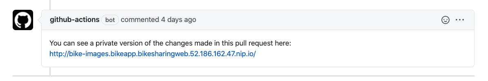

# GitHub Actions & Kubernetes Pull Request Flow (preview)

Local Process with Kubernetes (LPK) lets you work in isolation from colleagues using the same cluster and namespace by leveraging Microsoft’s new, proprietary routing technology. You can also apply the isolation capability outside the LPK experience, such as directly from a GitHub pull request. You can test changes from a PR directly in Kubernetes before the pull request is merged into the main branch of your repo. Having a running application to review changes of a pull request can increase confidence in proposed code changes. Testing your changes in the running application can also help other team members, such as product managers and designers, see the results of development work even in the early stages.

**Note**: This example uses GitHub workflows, but this capability is not limited to GitHub and can be applied to any CI/CD system. 

In this guide, you will learn how to:
- Deploy a large application with multiple microservices to a namespace.
- Prepare your cluster for routing by installing the routing manger service. 
- Set up CI/CD with GitHub actions.
- Test changes to a single microservice within the context of the full application.

> **Important**<br />
This feature is currently in preview. Previews are made available to you on the condition that you agree to the supplemental terms of use. Some aspects of this feature may change prior to general availability (GA).

## Prerequisites
- An Azure subscription. If you don't have an Azure subscription, you can create a free account.
- Azure CLI installed.
- A GitHub Account with GitHub Actions enabled.

## Create a Kubernetes cluster
Create an AKS cluster in a supported region. The below commands create a resource group called MyResourceGroup and an AKS cluster called MyAKS.

```
az group create \
    --name MyResourceGroup \
    --location eastus

az aks create \
    --resource-group MyResourceGroup \
    --name MyAKS \
    --location eastus \
    --node-count 3 \
    --generate-ssh-keys
```

## Install the sample application
Install the sample application on your cluster using the provided script. You can run this script using the Azure Cloud Shell.

```
git clone https://github.com/Microsoft/mindaro
cd mindaro
chmod +x ./local-process-quickstart.sh
./local-process-quickstart.sh -g MyResourceGroup -n MyAKS
```

Navigate to the sample application running your cluster by opening its public URL, which is displayed in the output of the installation script.

```
$ ./local-process-quickstart.sh -g MyResourceGroup -n MyAKS
Defaulting Dev spaces repository root to current directory : ~/mindaro
Setting the Kube context
...
To try out the app, open the url:
bikeapp.bikesharingweb.EXTERNAL_IP.nip.io
```

In the above sample, the public URL is `bikeapp.bikesharingweb.EXTERNAL_IP.nip.io`.

## Enable routing on the cluster
Once the BikeSharing sample application has been installed and is running in your cluster, deploy the routing manager into the same namespace.

```
kubectl apply -n bikeapp -f routingmanager.yml
```

Ensure the routing manager is successfully running with `kubectl get pods -n bikeapp`. You should see the pod running: 

```
routingmanager-deployment-78b96c5876-gptc2             1/1     Running     0          1d
```

## Create an Azure Container Registry

Create an Azure Container Registry (ACR):

> **Important**<br />
The name your ACR must be unique within Azure and contain 5-50 alphanumeric characters. Any letters you use must be lower case.

```
az acr create --resource-group MyResourceGroup --name <acrName> --sku Basic
```

Save the loginServer value from the output because it is used in a later step.

## Create a service principal for authentication

Use `az ad sp create-for-rbac` to create a service principal. For example:

```
az ad sp create-for-rbac --sdk-auth --skip-assignment
```

Save the JSON output because it is used in a later step.

Use `az aks show` to display the ID of your AKS cluster:

```
az aks show -g MyResourceGroup -n MyAKS  --query id
```

Use `az acr show` to display the ID of the ACR:
```
az acr show --name <acrName> --query id
```

Use `az role assignment` create to give Contributor access to your AKS cluster and AcrPush access to your ACR.

```
az role assignment create --assignee <ClientId> --scope <AKSId> --role Contributor
az role assignment create --assignee <ClientId>  --scope <ACRId> --role AcrPush
```

> **Important**<br />
You must be the owner of both your AKS cluster and ACR in order to give your service principal access to those resources.

## Configure your GitHub action

> **Important**<br />
You must have GitHub Actions enabled for your repository. To enable GitHub Actions for your repository, navigate to your repository on GitHub, click on the Actions tab, and choose to enable actions for this repository.

Navigate to your forked repository and click Settings. Click on Secrets in the left sidebar. Click Add a new secret to add each new secret below:
1.	***AZURE_CREDENTIALS***: the entire output from the service principal creation.
2.	***RESOURCE_GROUP***: the resource group for your AKS cluster, which in this example is MyResourceGroup.
3.	***CLUSTER_NAME***: the name of your AKS cluster, which in this example is MyAKS.
4.	***CONTAINER_REGISTRY***: the loginServer for the ACR.
5.	***HOST***: the URL for your application, which in this example is `bikeapp.bikesharingweb.EXTERNAL_IP.nip.io`
6.	***IMAGE_PULL_SECRET***: the name of the secret you wish to use, for example demo-secret.
7.	***MASTER_SPACE***: the namespace where your application is running, which in this example is `bikeapp`.
8.	***REGISTRY_USERNAME***: the clientId from the JSON output from the service principal creation.
9.	***REGISTRY_PASSWORD***: the clientSecret from the JSON output from the service principal creation.

**Note:** All of these secrets are used by the GitHub action and are configured in `.github/workflows/bikes.yml`.

## Create a new branch for code changes
Navigate to BikeSharingApp/ and create a new branch called bike-images.

```
cd mindaro/samples/BikeSharingApp/
git checkout -b bike-images
```

Edit Bikes/server.js to remove lines 232 and 233:

```
// Hard code image url *FIX ME*
theBike.imageUrl = "/static/logo.svg";
```

The section should now look like:

```
var theBike = result;
theBike.id = theBike._id;
delete theBike._id;
```

Save the file then use git add and git commit to stage your changes.

```
git add Bikes/server.js 
git commit -m "Removing hard coded imageUrl from /bikes/:id route"
```

## Push your changes
Use git push to push your new branch to your forked repository:

```
git push origin bike-images
```

After the push is complete, navigate to your forked repository on GitHub to create a pull request with the master branch in your forked repository as the base branch compared to the bike-images branch.

After your pull request is opened, navigate to the Actions tab. Verify a new action has started and is building the Bikes service.

## View the review app with your change

After the action has completed, you will see a comment with a URL to a review app based the changes in the pull request.


 
Navigate to the bikesharingweb service by opening the URL from the comment. Select Aurelia Briggs (customer) as the user, then select a bike to rent. Verify you no longer see the placeholder image for the bike.

If you merge your changes into the master branch in your fork, another action will run to rebuild and run your entire application in the parent dev space. In this example, the parent space is dev. This action is configured in `.github/workflows/bikesharing.yml`.

## Clean up your Azure resources

```
az group delete --name MyResourceGroup --yes --no-wait
```


